# Model Nomenclature <!-- omit in toc -->

---

## Table of Contents <!-- omit in toc -->

- [About](#about)
- [Repository Structure](#repository-structure)
  - [Doors (D)](#doors-d)
    - [D200](#d200)
    - [D350](#d350)
    - [D500](#d500)
  - [Storefronts (FG)](#storefronts-fg)
    - [FG450](#fg450)
    - [FG451](#fg451)
    - [FG451T](#fg451t)
  - [Curtain Walls (CW)](#curtain-walls-cw)
    - [CW250](#cw250)
    - [CW250P](#cw250p)
- [Nomenclature Guide](#nomenclature-guide)
  - [Category](#category)
  - [Model Number](#model-number)
  - [Length](#length)
  - [Model Type](#model-type)
  - [Leaf Count](#leaf-count)
  - [Finish](#finish)
- [Example Demonstration](#example-demonstration)

## About

This repository is used to store the 3-D models used on the GAMCO website, and to establish a standard for 3-D modeling being used the GAMCO processes. The models are in glb format, and have been created via Blender 5.0.

## Repository Structure

When referencing the currently available models, or creating new models, please refer to the images below as guides.

### Doors (D)

---

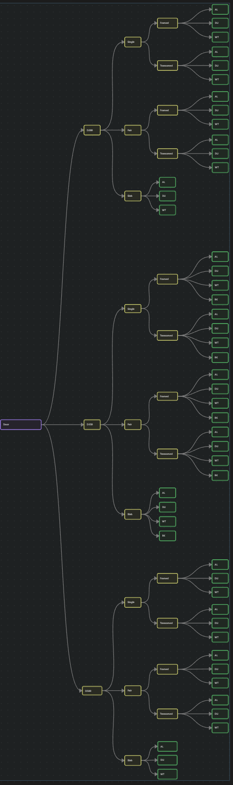

#### D200

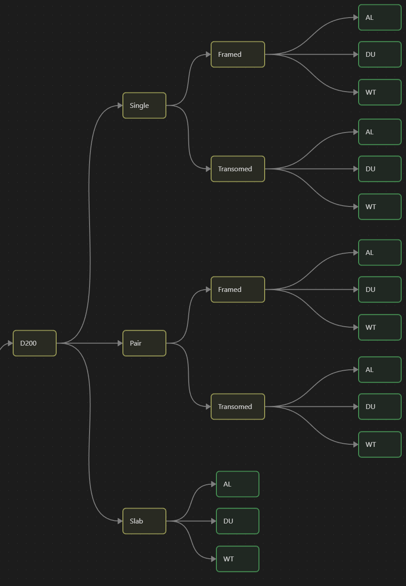

#### D350

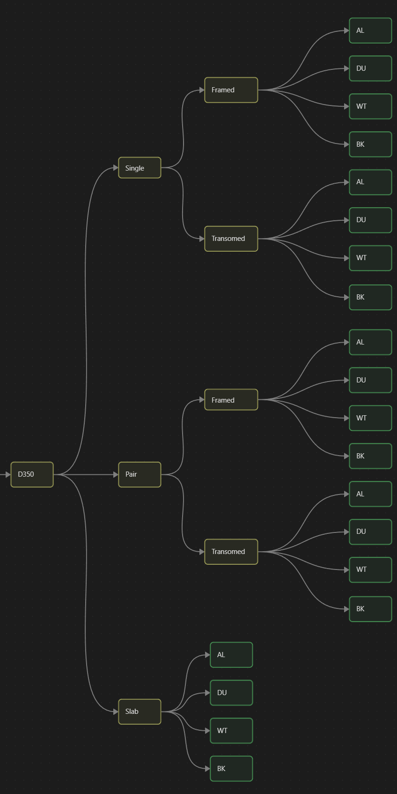

#### D500

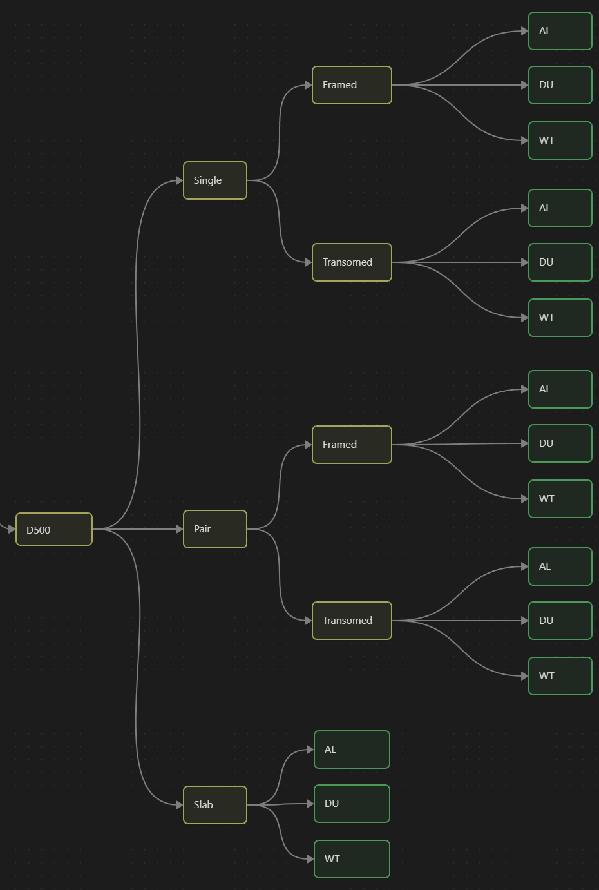

### Storefronts (FG)

---

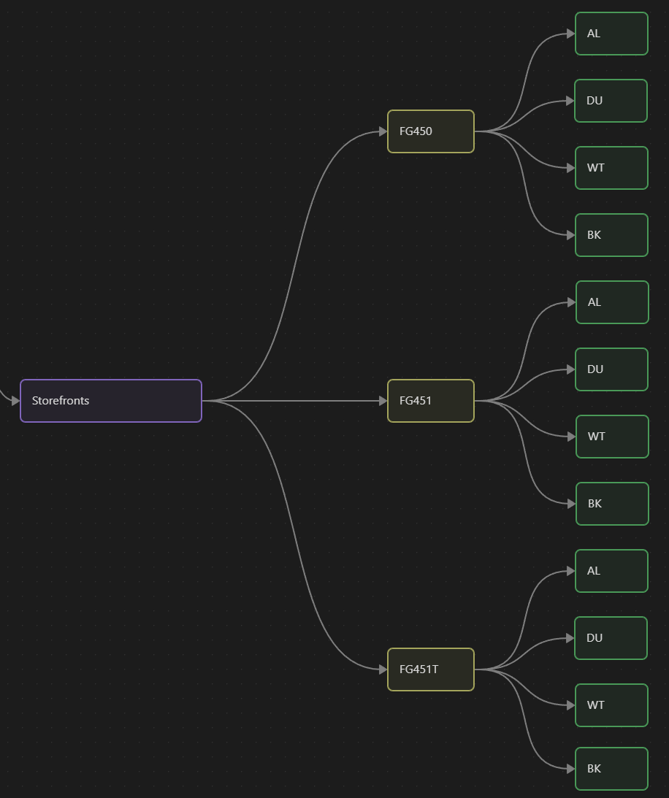

#### FG450

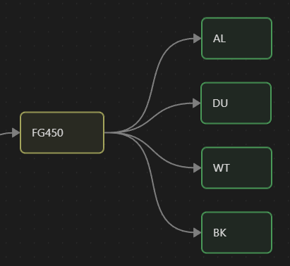

#### FG451

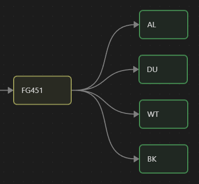

#### FG451T

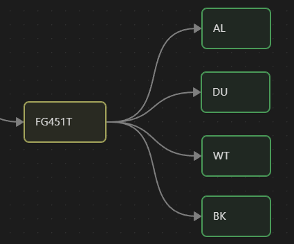

### Curtain Walls (CW)

---

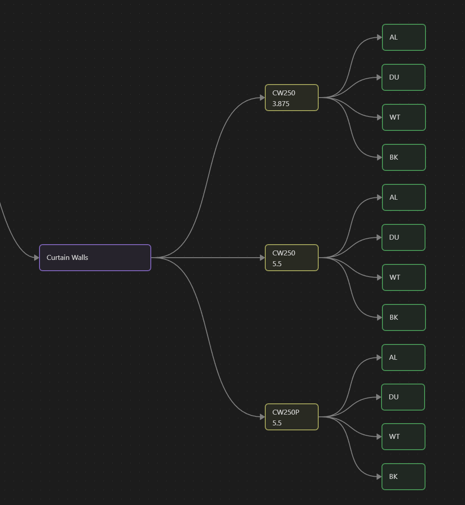

#### CW250

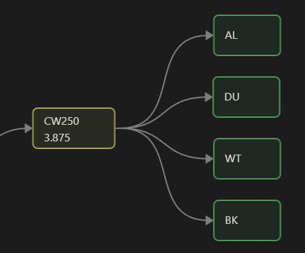
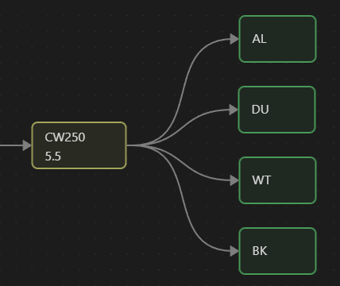

Length Variations:

- 3.875"
- 5.5"

#### CW250P

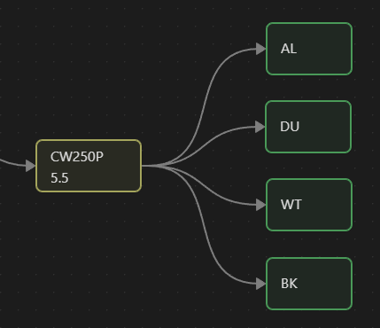

Length Variations:

- 5.5"

## Nomenclature Guide

XX.XXX.XXXX.XX.XX.XX.(anim)

| Section      | Color                                                                                                                 | Description                                                                |
| ------------ | --------------------------------------------------------------------------------------------------------------------- | -------------------------------------------------------------------------- |
| Category     |  | Describes the product line in the 3-D model                                |
| Model Number |  | Describes the model of product in the 3-D model                            |
| Length       |  | Describes the lengths used to differentiate model numbers in the 3-D model |
| Model Type   |  | Describes the structure type of Door objects in the 3-D model              |
| Leaf Count   |  | Describes the leaf count of doors present in the 3-D model                 |
| Finish       |  | Describes the color of the product in the 3-D model                        |

### Category

| Category Name | Abbreviation |
| ------------- | ------------ |
| Doors         | D            |
| Storefront    | FG           |
| Curtain Wall  | CW           |

### Model Number

| Category      | Model Options          | Abbreviation     |
| ------------- | ---------------------- | ---------------- |
| Doors         | D200 / D350 / D500     | 200 / 350 / 500  |
| Storefronts   | FG450 / FG451 / FG451T | 450 / 451 / 451T |
| Curtain Walls | CW250 / CW250P         | 250 / 250P       |

### Length

| Category      | Length Options | Abbreviation |
| ------------- | -------------- | ------------ |
| Doors         | N/A            | 0000         |
| Storefronts   | N/A            | 0000         |
| Curtain Walls | 3.875 / 5.5    | 3875 / 5500  |

### Model Type

| 3-D Model Type | Abbreviation |
| -------------- | ------------ |
| Slab           | SL           |
| Framed         | FR           |
| Transomed      | TR           |
| N/A            | 00           |

### Leaf Count

| Leaf Count    | Abbreviation |
| ------------- | ------------ |
| Single / Slab | 01           |
| Pair          | 02           |
| N/A           | 00           |

### Finish

| Finish               | Abbreviation |
| -------------------- | ------------ |
| Clear Anodized       | AL           |
| Dark Bronze Anodized | DU           |
| White Painted        | WT           |
| Black Painted        | BK           |
| Mill                 | MI           |

## Example Demonstration

FG.450.0000.00.00.AL.(anim)
From the definitions used above, we can conclude that this label indicates a storefront of model 450, and clear anodized.
